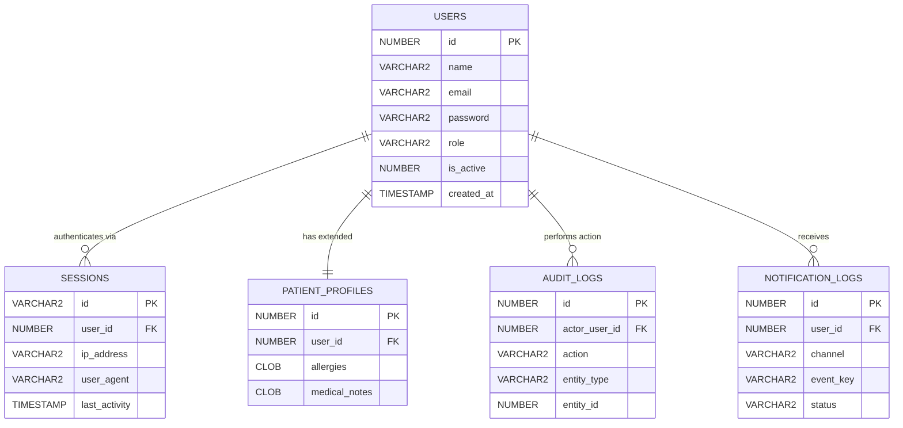
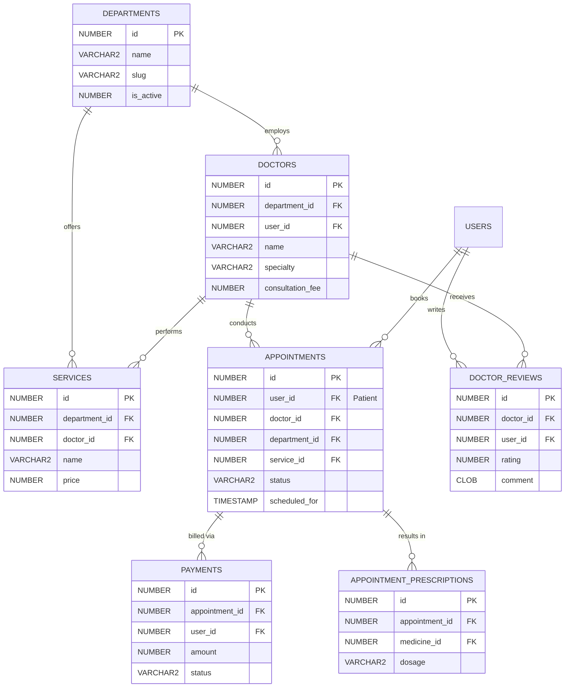
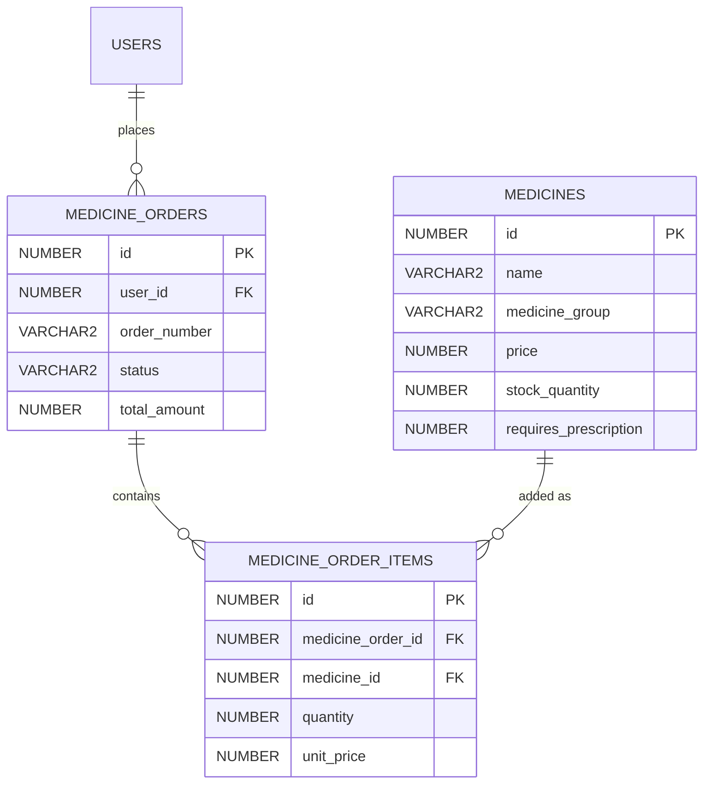
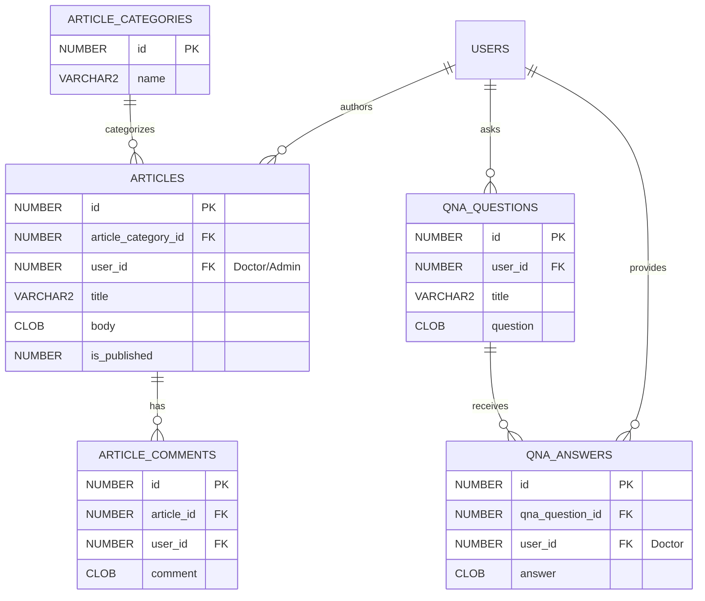
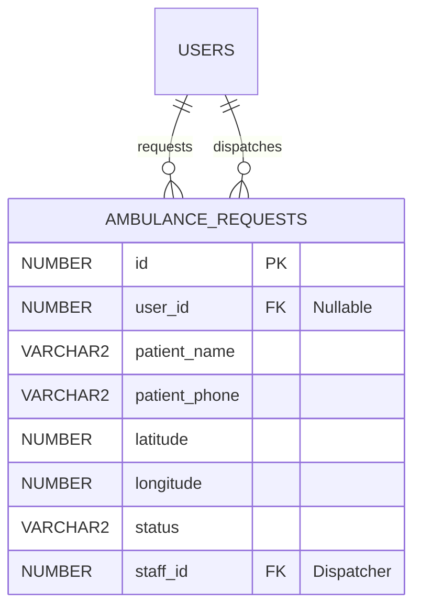

# HelloMed Entity-Relationship Diagrams

This document contains the complete graphical entity-relationship (ER) models for the HelloMed Oracle Database. 
The system is divided into five logical modules for easier visualization.

---

## 1. Core & Authentication System
Handles user identities, sessions, extended profiles, and system-wide logging.

---

## 2. Medical Services & Appointments
The backbone of the hospital's operations, connecting doctors, patients, departments, and scheduling.

---

## 3. Digital E-Pharmacy
Inventory management and digital medicine ordering.

---

## 4. Content CMS & Community Q&A
Public health articles authored by doctors and patient questions.

---

## 5. Emergency Dispatch
Real-time tracking of ambulance requests.

